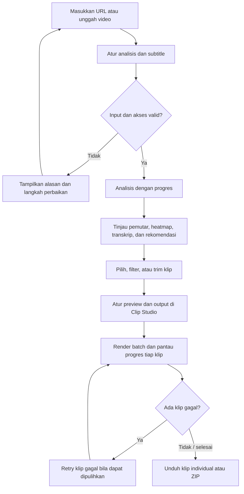
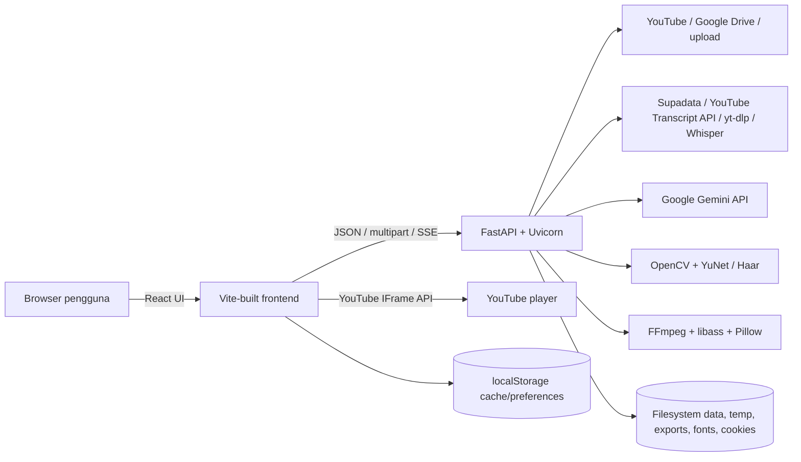

# Product Requirements Document — ECLIPSE

**Versi:** 0.1 (draft berbasis implementasi saat ini)  
**Tanggal:** 6 Oktober 2026  
**Status:** Draft untuk validasi produk  
**Pemilik produk:** Dema Digital Asia

## 1. Ringkasan produk

ECLIPSE adalah aplikasi untuk membantu kreator menemukan bagian menarik dari video panjang, mengubah pilihan tersebut menjadi klip pendek, lalu menyiapkan video untuk kanal sosial. Alur utama produk mencakup memasukkan sumber video, menganalisis transkrip dan momen, meninjau rekomendasi klip, menyesuaikan tampilan, merender beberapa klip sekaligus, dan mengunduh hasilnya.

Dokumen ini menggabungkan kapabilitas yang tampak pada implementasi saat ini dengan kebutuhan produk yang disarankan untuk menjadikannya andal dan siap digunakan lebih luas. Fitur yang tercantum sebagai **sudah ada** menjelaskan kondisi repo, bukan jaminan bahwa fitur telah lolos validasi pengguna atau siap untuk layanan publik.

## 2. Masalah pengguna

Kreator yang mengolah rekaman panjang perlu menonton ulang, mencari momen yang layak dijadikan klip, menentukan titik potong, membuat subtitle, mengatur format dan branding, lalu mengekspor satu per satu. Proses manual ini memakan waktu dan membuat hasil antar-klip tidak konsisten.

ECLIPSE bertujuan mempersingkat proses tersebut dengan rekomendasi momen berbantuan AI dan satu studio untuk meninjau, menyunting konfigurasi, serta merender banyak klip.

## 3. Pengguna sasaran

- **Kreator solo / podcaster:** ingin menemukan beberapa klip menarik dari episode atau siaran panjang tanpa alur penyuntingan yang rumit.
- **Editor konten:** perlu meninjau rekomendasi, memperbaiki rentang waktu, memilih subtitle, dan menyiapkan beberapa variasi output.
- **Tim kecil media sosial:** perlu gaya visual dan branding yang konsisten ketika menghasilkan beberapa klip dari satu sumber.

Asumsi awal: pengguna memiliki hak atau izin untuk menggunakan video sumber dan dapat menyediakan URL, berkas video, transkrip, serta kredensial layanan AI yang dibutuhkan.

## 4. Tujuan dan ukuran keberhasilan

### Tujuan

1. Mempercepat proses dari video panjang ke daftar klip yang siap ditinjau.
2. Memberi pengguna kontrol editorial sebelum klip dirender.
3. Memungkinkan batch render dengan progres yang jelas dan hasil yang dapat diunduh.
4. Menghasilkan file video dengan format, subtitle, audio, dan branding yang dapat dikonfigurasi.
5. Memberi penjelasan dan pemulihan yang berguna ketika sumber, analisis, atau render gagal.

### Metrik produk yang diusulkan

- **Waktu menuju klip pertama:** median waktu sejak analisis dimulai sampai klip hasil pertama siap diunduh.
- **Tingkat penyelesaian alur:** persentase sesi analisis yang berakhir dengan setidaknya satu klip berhasil diunduh.
- **Keberhasilan analisis:** persentase permintaan analisis yang menghasilkan respons valid dengan transkrip/klip.
- **Keberhasilan render batch:** persentase klip terpilih yang selesai dirender.
- **Penggunaan rekomendasi:** proporsi klip rekomendasi yang dipilih atau rentang waktunya disunting pengguna.
- **Pemulihan mandiri:** persentase kegagalan yang diselesaikan melalui retry atau langkah bantuan tanpa meninggalkan alur.

Nilai target dan instrumentasi analitik perlu ditetapkan setelah tersedia data dasar dan keputusan mengenai penggunaan anonim atau berbasis akun.

## 5. Cakupan

### Termasuk dalam produk saat ini

- Input sumber melalui URL YouTube, URL Google Drive, atau unggah video.
- Preferensi durasi klip (15, 30, 60 detik, atau otomatis), jumlah klip, rentang analisis khusus, prompt fokus, dan pilihan model AI.
- Penggunaan subtitle/transkrip dari sumber atau unggahan subtitle `.srt`/`.txt`.
- Tampilan hasil yang mencakup pemutar video, ringkasan, transkrip, heatmap, skor viralitas, kutipan, saran judul/caption/hashtag, serta waktu mulai/akhir yang dapat ditinjau.
- Pencarian, filter, pengurutan, penandaan klip, checklist klip terpilih, dan penyesuaian rentang/waktu melalui trimmer dengan preview dan kontrol lompatan waktu.
- Ekspor daftar klip sebagai JSON, transkrip sebagai SRT, salin hasil ke Markdown, serta salin timestamp dalam beberapa format.
- Riwayat analisis lokal berbasis browser: pengguna dapat mencari, membuka kembali hasil cache, dan menghapus satu atau seluruh entri.
- Unduh video sumber atau klip mentah secara asinkron dengan tampilan progres.
- Studio untuk memilih klip, mengubah judul tiap klip dan pola nama file, rasio output, latar, crop/focus wajah, layout facecam, judul, subtitle, font, posisi teks, audio, watermark, dan encoder.
- Pilihan output saat ini mencakup 9:16, 1:1, 4:3, 16:9, dan true landscape 16:9; subtitle memiliki preset gaya `viral_pop`, `beast_punch`, `cyber_violet`, `fire_red`, `electric_cyan`, `golden_aura`, `clean_minimal`, atau off.
- Batch render dengan pembaruan progres, retry klip gagal, unduhan per klip dan ZIP.
- Pengaturan cookie YouTube, unggah font tambahan, info encoder, pemeriksaan/pembersihan penyimpanan sementara, serta status versi dan update pada instalasi yang mendukungnya.
- Preferensi analisis tertentu (misalnya durasi, jumlah klip, model, dan API key Gemini) disimpan di browser untuk digunakan kembali.
- Antarmuka bahasa Inggris dan Indonesia.

### Tidak termasuk dalam sasaran draft ini

- Editor timeline penuh dengan banyak track dan penyuntingan frame-by-frame.
- Publikasi langsung ke TikTok, YouTube Shorts, Instagram, atau kanal sosial lain.
- Kolaborasi real-time, komentar, persetujuan tim, atau pengelolaan workspace organisasi.
- Jaminan bahwa skor AI memprediksi performa atau viralitas aktual.
- Sistem pembayaran, paket langganan, atau kuota komersial sebelum model bisnis diputuskan.

## 6. Workflow pengguna

### Langkah penggunaan

1. **Masukkan sumber:** pengguna memilih YouTube, Google Drive, atau unggah berkas. Untuk sumber yang didukung, aplikasi menampilkan video di pemutar. Pengguna juga dapat membuka hasil analisis sebelumnya dari riwayat lokal.
2. **Atur analisis:** pengguna menentukan durasi target dan jumlah klip (otomatis atau manual), seluruh/segmen khusus, prompt fokus, model, dan subtitle otomatis atau file subtitle manual. Preferensi tertentu dapat dipakai kembali dari browser.
3. **Jalankan analisis:** aplikasi memeriksa input dan konfigurasi yang diperlukan, lalu menampilkan tahapan, progres, detail aktivitas, model aktif, dan waktu berjalan. Jika gagal, tampilkan penyebab serta tindakan pemulihan.
4. **Tinjau hasil:** pengguna melihat ringkasan, video, transkrip, heatmap, skor, kutipan, dan saran konten. Pengguna dapat mencari, mengurutkan, memfilter, menandai, menyalin timestamp, mengekspor JSON/SRT/Markdown, atau membuka trimmer.
5. **Pilih dan rapikan klip:** pengguna menyesuaikan judul dan titik awal/akhir dengan preview, kontrol waktu presisi, serta pilihan unduh potongan mentah bila dibutuhkan.
6. **Siapkan output:** pengguna memilih klip di Clip Studio, memeriksa preview per klip, lalu mengatur rasio, latar, crop/focus, layout, judul, subtitle/font/posisi, audio, watermark, nama file, dan encoder.
7. **Render dan pulihkan:** pengguna memulai batch, memantau status tiap klip dan progres keseluruhan, lalu retry klip yang gagal jika memungkinkan. Kegagalan satu klip tidak seharusnya menghapus hasil klip lain yang sudah selesai.
8. **Unduh:** pengguna mengambil hasil individual atau ZIP. Pengguna juga dapat mengunduh sumber/klip mentah, menyalin data hasil, dan membersihkan file sementara melalui kontrol yang tersedia.

Alur alternatif: bila media/subtitle/API key/cookie tidak tersedia atau sumber gagal diproses, aplikasi harus menjelaskan apa yang diperlukan dan mempertahankan input yang sudah diisi agar pengguna dapat mencoba lagi.

### Detail perilaku produk yang terverifikasi di UI/kode

- Analisis memilih durasi `15s`, `30s`, `60s`, atau `auto`; mode manual jumlah klip dibatasi kontrol UI sampai 50, sementara mode otomatis di backend membatasi hasil maksimal sekitar 200 klip.
- Rentang custom menerima detik numerik, `MM:SS`, atau `HH:MM:SS`. Input rentang tetap perlu divalidasi terhadap durasi sumber sebelum dikirim.
- Model default frontend adalah `gemini-2.5-flash`; model dapat dimuat dari Gemini API dan backend mempertahankan daftar fallback Flash yang diketahui.
- Hasil dapat dicari, difilter sebagai semua/skor tinggi/skor menengah/ditandai, dan diurut berdasarkan skor, waktu, durasi, atau status tanda. Filter skor tinggi saat ini memakai ambang 90.
- Riwayat menggunakan cache hasil pada browser; pengguna dapat mencari entri, memuat kembali, menghapus satu, atau menghapus seluruh riwayat. Ini bukan arsip media di server.
- Trimmer menyediakan preview playback, mute/volume, pengaturan awal/akhir, lompatan waktu, preset rentang, serta apply/reset. UI trimmer menyatakan konteks terbatas sekitar ±2 menit.
- Clip Studio menyediakan preview layout serta pilihan crop/focus wajah, facecam split-top/PiP, posisi, latar hitam/blur, judul, prefix/suffix nama file, aturan penempatan/durasi judul, posisi subtitle, teks besar/kecil/custom, text case, dan font bawaan/unggahan.
- Ukuran output yang ditampilkan UI: 9:16 = 1080×1920, 1:1 = 1080×1080, 4:3 = 1440×1080, landscape 16:9 = 1920×1080.
- BGM dan hook SFX memiliki kontrol aktif, volume, offset untuk BGM; audio asli dapat dinaikkan/diturunkan. Watermark mendukung gambar/teks, ukuran, opacity, posisi X/Y, dan preset posisi.
- Pengunduhan mentah berjalan sebagai job dengan endpoint polling status; progres batch render berjalan lewat SSE/EventSource. Itu dua jalur progres berbeda.

## 7. Persyaratan fungsional

Prioritas: **P0** = penting untuk alur inti; **P1** = meningkatkan kualitas/keandalan; **P2** = lanjutan.

| ID | Persyaratan | Prioritas | Kriteria penerimaan |
|---|---|---|---|
| FR-01 | Aplikasi menerima sumber video YouTube, Google Drive, dan unggahan berkas yang didukung. | P0 | Pengguna dapat memilih sumber, memasukkan/unggah media, dan menerima pesan yang jelas jika sumber tidak dapat dibaca. Batas jenis dan ukuran berkas dijelaskan sebelum unggah. |
| FR-02 | Pengguna dapat mengatur parameter analisis: durasi target, jumlah klip, seluruh/segmen khusus, prompt fokus, model, dan subtitle otomatis/manual sesuai sumber. | P0 | Input tidak valid ditolak sebelum proses dimulai; parameter yang dipilih diteruskan ke analisis dan terlihat selama sesi. |
| FR-03 | Aplikasi menganalisis sumber dan menyajikan ringkasan, transkrip, heatmap, serta daftar klip dengan judul, rentang waktu, skor, dan kutipan bila tersedia. | P0 | Hasil menampilkan waktu yang dapat dinavigasi, data yang tersedia tidak dikarang, dan keadaan tanpa hasil/error memiliki instruksi berikutnya. |
| FR-04 | Pengguna dapat menemukan, menandai, dan memilih rekomendasi. | P0 | Pencarian, filter, urutkan, checklist, pilih semua, dan pilihan untuk batch tetap konsisten setelah perubahan daftar. |
| FR-05 | Pengguna dapat meninjau dan trim klip dengan preview, edit waktu/judul, kontrol lompatan, serta unduh potongan mentah. | P0 | Awal/akhir tervalidasi terhadap durasi sumber; preview berpindah ke waktu yang dipilih; pengguna bisa menerapkan hasil edit atau mengembalikan nilai semula. |
| FR-06 | Pengguna dapat menyalin dan mengekspor hasil analisis. | P1 | JSON berisi data klip; SRT berisi transkrip bila tersedia; Markdown dan format timestamp dapat disalin; UI memberi konfirmasi dan pesan jika data yang diminta tidak tersedia. |
| FR-07 | Studio memungkinkan konfigurasi output: rasio, latar, tracking/focus, layout facecam, judul per klip, pola nama file, subtitle/font/posisi, dan preview. | P0 | Preview mencerminkan konfigurasi utama dan konfigurasi yang dikirim ke render; pengguna dapat meninjau klip contoh sebelum memulai batch. |
| FR-08 | Studio mendukung konfigurasi audio dan branding: musik latar, hook SFX, level audio sumber, dan watermark gambar/teks. | P1 | Pengguna dapat mengaktifkan/nonaktifkan fitur, mengunggah aset yang didukung, mengatur parameter, dan melihat status aset sebelum render. |
| FR-09 | Pengguna dapat merender klip secara batch dan memantau progres per klip serta keseluruhan. | P0 | Progres memiliki status pending/processing/success/failure yang konsisten; pekerjaan selesai tetap dapat diunduh setelah koneksi UI terputus dan tersambung kembali. |
| FR-10 | Pengguna dapat mencoba ulang klip gagal dan mengunduh hasil per klip atau sebagai ZIP. | P0 | Retry hanya menjalankan klip yang dipilih/gagal; unduhan hanya tersedia untuk hasil yang selesai; kesalahan ZIP tidak menghilangkan hasil individual. |
| FR-11 | Aplikasi menyediakan pengaturan operasional untuk API key/model, cookie, font, encoder, versi aplikasi, dan ruang sementara sesuai mode deployment. | P1 | Status aman tanpa nilai rahasia; aksi admin dibatasi ke pengguna berwenang; opsi yang tidak didukung deployment disembunyikan atau diberi penjelasan. |
| FR-12 | UI menyediakan bahasa Indonesia dan Inggris. | P1 | Pengguna dapat berpindah bahasa; label, error, status, dan instruksi alur inti tersedia dalam kedua bahasa. |
| FR-13 | Preferensi dan riwayat analisis dapat disimpan serta digunakan lagi. | P2 | Pengguna dapat mencari, membuka, dan menghapus entri riwayat; batas kapasitas/retensi cache jelas; rahasia tidak disimpan tanpa perlindungan yang sesuai. |

## 8. Persyaratan kualitas dan operasional

- **Keamanan dan privasi:** rahasia API/cookie tidak boleh muncul di URL, log, pesan error, atau respons status. Operasi berbiaya/administratif harus memiliki autentikasi dan pembatasan penggunaan sebelum backend dibuka ke publik.
- **Penyimpanan browser:** implementasi saat ini menyimpan Gemini API key dan beberapa preferensi di `localStorage`. Untuk rilis publik, tentukan model manajemen secret yang sesuai dan jelaskan bahwa riwayat/cache lokal melekat pada browser/perangkat serta dapat terhapus karena kuota browser.
- **Isolasi data:** media, hasil, cookie, dan pekerjaan harus dipisahkan antar pengguna jika deployment multi-user dipilih. Tetapkan retensi dan penghapusan data yang dapat dipahami pengguna.
- **Ketahanan pekerjaan:** render panjang perlu tetap terlacak setelah restart atau reconnect UI. Untuk skala lebih dari satu proses, status pekerjaan dan file tidak boleh bergantung pada memori lokal satu proses.
- **Kinerja:** aplikasi menampilkan status progres untuk operasi panjang, membatasi ukuran/jumlah pekerjaan sesuai kapasitas, dan memberi estimasi atau pesan bila durasi tidak dapat diperkirakan.
- **Kompatibilitas output:** encoder dan ukuran output yang didukung harus ditampilkan sesuai kapabilitas runtime; fallback CPU harus tersedia bila hardware encoder tidak tersedia.
- **Aksesibilitas:** kontrol utama dapat dioperasikan dengan keyboard, memiliki label yang dapat dibaca teknologi bantu, dan tidak mengandalkan warna saja untuk status.
- **Kualitas rilis:** alur sumber → analisis → pemilihan → render → unduh perlu memiliki pemeriksaan otomatis dan smoke test pada lingkungan deployment yang didukung.
- **Bahasa produk:** antarmuka inti harus terlokalisasi konsisten; pesan kegagalan teknis perlu menyertakan langkah pemulihan yang relevan.

## 9. Aturan dan batasan produk

- Rekomendasi AI adalah bantuan editorial. Pengguna tetap menentukan klip yang dipilih dan hasil akhir.
- Rentang klip harus berada di dalam durasi sumber dan memiliki akhir lebih besar daripada awal.
- Hasil render batch dapat bersifat parsial: kegagalan satu klip tidak semestinya menghalangi unduhan klip lain yang berhasil.
- Format sumber, batas ukuran, durasi maksimum, jenis subtitle, encoder, dan jumlah render paralel perlu ditentukan sebagai kebijakan produk berdasarkan kapasitas deployment.
- Persyaratan hak penggunaan konten dan kepatuhan ketentuan platform sumber perlu ditinjau sebelum peluncuran publik.

## 10. Risiko dan dependensi

- **Sumber eksternal:** akses YouTube/Google Drive dan transkrip dapat berubah atau dibatasi oleh layanan pihak ketiga.
- **Biaya dan performa:** analisis AI, transkripsi, unduhan, dan render memakai API, bandwidth, CPU/GPU, dan storage.
- **Operasional:** implementasi saat ini menggunakan backend Python, FFmpeg, filesystem dan state pekerjaan dalam proses; deployment publik/multi-instance memerlukan arsitektur storage dan job yang sesuai.
- **Keamanan:** audit deployment yang ada mencatat kebutuhan autentikasi/rate limit pada endpoint berbiaya, isolasi cookie, serta perlindungan route admin sebelum membuka layanan publik.
- **Hasil AI:** kualitas transkrip dan rekomendasi bergantung pada audio, subtitle, bahasa, dan model yang dipilih.
- **Pemulihan pekerjaan:** pengguna perlu dapat memahami apa yang masih tersedia setelah reload, koneksi terputus, atau proses backend restart.

## 11. Rekomendasi tahapan

### Tahap 1 — Alur inti yang andal

- Tetapkan batas sumber/berkas serta error dan validasi yang konsisten.
- Pastikan status analisis dan render dapat dipulihkan setelah reconnect.
- Sediakan unduhan hasil parsial dan pembersihan media berdasarkan retensi.
- Tambahkan metrik keberhasilan alur dan pemeriksaan otomatis untuk kasus inti.

### Tahap 2 — Kesiapan layanan publik

- Putuskan apakah produk lokal/single-user atau layanan multi-user.
- Untuk layanan publik: autentikasi, kuota/rate limit, isolasi penyimpanan, kebijakan retensi, dan audit akses.
- Pindahkan status job ke penyimpanan bersama/queue dan media ke object storage bila perlu multi-instance atau pekerjaan tahan restart.
- Tetapkan kebijakan cookie sumber dan cara aman mengelola kunci AI.

### Tahap 3 — Peningkatan produktivitas kreator

- Simpan preset studio dan riwayat proyek.
- Tingkatkan kontrol hasil AI dan kemudahan membandingkan pilihan klip.
- Evaluasi kolaborasi, ekspor platform, dan publikasi langsung berdasarkan metrik penggunaan serta kebutuhan pengguna.

## 12. Pertanyaan produk yang perlu diputuskan

1. Apakah ECLIPSE ditujukan sebagai aplikasi desktop/lokal, layanan web satu pengguna, atau SaaS multi-pengguna?
2. Apakah pengguna harus masuk akun? Jika ya, bagaimana proyek, file, kuota, dan kepemilikan akun dikelola?
3. Siapa yang menanggung penggunaan Gemini/transkripsi: pengguna dengan API key sendiri atau layanan ECLIPSE?
4. Berapa batas unggah, durasi sumber, jumlah klip, render serentak, dan lama penyimpanan file?
5. Apakah dukungan Google Drive mengharuskan izin publik/link, atau akan menggunakan OAuth pengguna?
6. Bagaimana kebijakan cookie YouTube ditangani, dan apakah fitur ini hanya untuk instalasi privat/lokal?
7. Platform sosial dan spesifikasi ekspor mana yang paling penting untuk diprioritaskan?
8. Metrik target apa yang akan menentukan bahwa pengalaman analisis dan render berhasil?

## 13. Hasil pemeriksaan cakupan tambahan

Pemeriksaan ulang frontend dan endpoint backend menemukan beberapa fitur yang belum disebut secara eksplisit pada draft sebelumnya. Fitur tersebut sudah ditambahkan ke cakupan, workflow, atau persyaratan di atas:

- Riwayat analisis lokal dengan pencarian, buka kembali dari cache, dan hapus satu/semua entri.
- Pemutar hasil, pemetaan heatmap/transkrip, saran judul/caption/hashtag, serta penyalinan timestamp dan ekspor JSON/SRT/Markdown.
- Trimmer dengan preview, kontrol waktu/lompatan, edit judul/rentang, preset rentang, dan unduh klip mentah.
- Status progres untuk unduhan sumber/klip mentah selain progres batch render.
- Pengaturan Clip Studio yang lebih rinci: judul dan nama file per klip, format aspect ratio, layout facecam, posisi teks, font unggahan, musik/SFX, level audio, watermark, dan pilihan hardware encoder.
- Utilitas instalasi: cek versi/update, status serta pembersihan ruang sementara, dan pengelolaan cookie sumber.

### Kesenjangan produk yang belum terlihat di implementasi yang diperiksa

Hal berikut jangan dianggap sebagai kemampuan yang sudah ada. Sebagian dapat menjadi ruang lingkup produk berikutnya setelah keputusan produk dibuat:

- Akun pengguna, proyek/workspace tersinkron lintas perangkat, dan kepemilikan media berbasis akun. Riwayat yang ditemukan tersimpan di browser lokal.
- Pembatalan, jeda, atau resume pekerjaan analisis/render yang berjalan; UI yang ditemukan mendukung pemantauan dan retry klip gagal.
- Preset Clip Studio yang disimpan untuk dipakai ulang di proyek lain; preferensi analisis lokal sudah ada, tetapi preset studio persisten tidak tampak.
- Kolaborasi/approval tim, publikasi langsung ke platform sosial, dan analitik performa setelah publikasi.
- Definisi SLA, target metrik kuantitatif, kuota pengguna, dan kebijakan retensi final.

Item ini dicatat sebagai keputusan/roadmap, bukan dijanjikan sebagai fitur aktif.

## 14. Teknologi produk saat ini

Inventaris ini merangkum teknologi yang dideklarasikan atau dirujuk oleh repo. Nomor versi di bawah adalah rentang versi dari manifest, bukan klaim versi runtime yang sedang terpasang.

**Posisi produk saat ini:** repo menjalankan aplikasi web lokal/self-hosted dengan frontend dan backend terpisah. Petunjuk README menjalankan keduanya di mesin pengguna; dokumentasi deploy menyarankan Vercel hanya untuk frontend dan satu container backend persisten. Akun dan multi-tenant belum menjadi bagian implementasi.

| Lapisan | Teknologi | Peran dalam ECLIPSE |
|---|---|---|
| Frontend | React `^19.2.6`, React DOM `^19.2.6` | UI single-page untuk input sumber, hasil analisis, riwayat, trimmer, Clip Studio, dan progres. |
| Bahasa frontend | TypeScript `~6.0.2` | Tipe untuk respons analisis, klip, render settings, dan progres batch. |
| Dev server/build | Vite `^8.0.12`, `@vitejs/plugin-react ^6.0.1` | Menyajikan frontend, membangun bundle, dan mem-proxy `/api` ke backend saat development. |
| Style/UI | CSS biasa (`src/*.css`, component styles) | Tema, layout responsif, preview, modal, dan kontrol; tidak ada framework komponen UI yang tercantum di dependency utama. |
| Komunikasi browser | Fetch, `EventSource`, Server-Sent Events (SSE), YouTube IFrame API | REST-like JSON untuk perintah/status, stream SSE untuk progres analisis/render, pemutar YouTube untuk sumber YouTube. |
| State browser | React state/hooks dan `localStorage` | State UI; preferensi, cache hasil/riwayat, dan beberapa tanda pilihan klip tetap berada di browser. |
| Backend API | FastAPI `>=0.100.0`, Uvicorn `>=0.22.0`, Pydantic `>=2.0.0` | API ASGI, validasi payload, streaming respons, dan dokumentasi OpenAPI lokal. |
| Upload/API forms | `python-multipart >=0.0.9` | Menerima unggahan video, audio, gambar, dan font. |
| Konfigurasi backend | `python-dotenv >=1.0.0` | Memuat nilai konfigurasi dari environment dan file `.env` lokal. |
| AI generatif | Google Gen AI SDK `google-genai >=2.0.0` dan Gemini API | Menganalisis transkrip untuk ringkasan, kandidat klip, skor, kutipan, serta saran judul/caption/hashtag. Model dapat dipilih; kode menyediakan pencarian model Flash dan fallback. |
| Transkrip YouTube | `youtube-transcript-api >=1.2.0`, `yt-dlp >=2026.0.0`, opsional Supadata | Mengambil subtitle/transkrip melalui beberapa fallback yang mendukung proxy/cookie. |
| Sumber/media HTTP | `requests >=2.31.0`, `yt-dlp` | Mengambil metadata/media, mendukung YouTube dan jalur Google Drive. |
| Transkripsi lokal | OpenAI Whisper (`openai-whisper >=20231117`) dengan model `base`, PyTorch `>=2.0.0`, NumPy `>=1.24.0` | Membuat transkrip bertimestamp untuk video unggahan/Drive ketika subtitle manual tidak diberikan; dipakai juga untuk kata-kata subtitle render sesuai alur render. |
| Video/audio | FFmpeg eksternal, filter `subtitles` dengan libass | Probe metadata, ekstraksi frame/audio, pemotongan, compositing, subtitle ASS, encoding MP4, dan packaging output. FFmpeg bukan paket npm/pip; binary harus ada di host/image. |
| Computer vision | OpenCV `opencv-python >=4.8.0`, model ONNX YuNet dan Haar cascades | Deteksi wajah/objek dan koordinat fokus/crop untuk preview/render. |
| Overlay gambar/teks | Pillow `Pillow >=10.0.0` | Menggambar judul/overlay PNG dan menangani fallback font/emoji. |
| Packaging layanan | Dockerfile berbasis `python:3.12-slim`, FFmpeg, libass dan library OS | Contoh image backend container; direktori data diarahkan ke volume `/var/lib/eclipse`. Image belum dinyatakan sebagai build/runtime tervalidasi hanya karena Dockerfile tersedia. |

### Integrasi eksternal dan kebutuhan konfigurasi

- **Google Gemini:** key pengguna dikirim bersama permintaan analisis; daftar model memakai header `X-Gemini-API-Key`. Key server opsional dapat diatur lewat `GEMINI_API_KEY`.
- **YouTube:** `yt-dlp` dipakai untuk metadata dan media; pemutar web memakai YouTube IFrame API. Cookie Netscape dapat dikonfigurasi untuk akses yang memerlukannya.
- **Supadata:** fallback cloud transkrip jika `SUPADATA_API_KEYS` disediakan; kode mendukung beberapa key dan menampilkan informasi pemakaian.
- **Proxy jaringan:** opsi Webshare atau `PROXY_URL`/`WEBSHARE_PROXY` dapat digunakan untuk akses transcript/YouTube bila jaringan membatasi request.
- **Google Drive:** service mencoba extractor `yt-dlp`, lalu fallback unduh HTTP langsung untuk link yang dapat diakses. Implementasi ini tidak menunjukkan OAuth Drive pengguna.
- **FFmpeg:** `ECLIPSE_FFMPEG_PATH` dapat menunjuk executable; render subtitle memerlukan filter FFmpeg `subtitles`/libass.
- **Penyimpanan:** `ECLIPSE_DATA_DIR` memilih root direktori writable; `ALLOWED_ORIGINS` mengatur CORS; `ADMIN_API_KEY`/alias terkait dipakai pada route administrasi.

## 15. Arsitektur aplikasi

Frontend dan backend adalah dua proses. Dalam development, `npm run dev` menjalankan Vite dan launcher Python secara bersamaan; proxy Vite meneruskan `/api`, `/docs`, `/redoc`, dan `/openapi.json` ke `127.0.0.1:8000`. Backend dapat dijalankan langsung dengan Uvicorn. Tidak ditemukan database, ORM, Redis, broker pesan, object storage SDK, autentikasi akun, atau router frontend dalam manifest/struktur yang ditinjau.

### Modul backend

- `backend/routers/analyze.py`: health/model list, analisis streaming, ekstraksi metadata, heatmap, transcript, prompt/model fallback, dan respons hasil.
- `backend/routers/render.py` + `backend/services/render_service.py`: memulai batch, retry, SSE progress, unduh MP4/ZIP, dan deteksi encoder.
- `backend/routers/downloads.py` + `download_service.py`: pekerjaan asinkron untuk unduh video penuh/segmen dan endpoint statusnya.
- `backend/routers/media.py`: unggah dan serve video/audio/watermark/font, ekstraksi frame, serta deteksi wajah.
- `backend/routers/cookies.py`: simpan, periksa status, dan hapus cookie YouTube.
- `backend/routers/system.py` + `system_service.py`: penggunaan/pembersihan file sementara, informasi versi, update/restart instalasi.
- `backend/video_engine.py`: integrasi FFmpeg, Whisper, OpenCV, Pillow, encoder, file sementara, pemotongan, subtitle, dan compositing render.

## 16. Pipeline perilaku teknis

### Analisis

1. Browser mengirim `POST /api/analyze` dan membaca SSE. Event menyampaikan tahapan/progres, teks status, detail, model aktif, error, lalu event final dengan `result`.
2. Backend mengklasifikasikan sumber sebagai URL YouTube, URL Google Drive, atau video upload/lokal. Google Drive diunduh ke direktori uploads; upload sudah berada pada direktori data.
3. Metadata YouTube diambil menggunakan `yt-dlp`, dengan oEmbed untuk fallback judul. Field heatmap digunakan hanya bila metadata menyediakannya. Untuk video lokal/Drive, metadata dibaca dari file dan heatmap dihitung sebagai kurva energi audio sekitar 100 titik.
4. Jika subtitle manual disediakan, parser membaca konten SRT/TXT bertimestamp. Untuk YouTube tanpa subtitle manual, fungsi `fetch_transcript` mencoba pipeline berlapis: Supadata (bila key tersedia), YouTube Transcript API via proxy, CLI, yt-dlp, lalu beberapa percobaan direct. Jika semua gagal, error memuat diagnosa serta opsi upload subtitle manual.
5. Untuk video lokal/Drive tanpa subtitle manual, audio ditranskripsi menggunakan Whisper model `base`. Transcript kemudian digunakan dalam analisis.
6. Backend mendeteksi bahasa transkrip, merakit konteks dan instruksi fokus/rentang/jumlah klip, memanggil Gemini melalui Google Gen AI SDK, serta mencoba model Flash fallback bila model yang diminta gagal/tidak tersedia. Respons bertipe Pydantic `VideoAnalysis` dikonversi menjadi klip, saran, summary, transcript, dan heatmap.
7. UI mempresentasikan hasil dan menyimpan cache hasil/history tertentu di `localStorage`. Cache ini tidak sama dengan penyimpanan proyek server.

**Makna skor/heatmap:** `virality_score` adalah penilaian kandidat AI, bukan metrik performa aktual. Heatmap YouTube dapat berasal dari metadata yang tersedia; heatmap video unggahan/Drive merupakan estimasi energi audio, bukan data retensi penonton. UI/marketing perlu membedakan sumber dan arti nilai tersebut.

### Render

1. Browser mengirim `POST /api/render-batch` berisi klip terpilih, metadata sumber/transkrip, dan konfigurasi `RenderSettingsModel`.
2. Backend membuat `batch_id`, menyimpan konfigurasi dan status di dictionary proses `RENDER_BATCHES`/`BATCH_REQUESTS`, lalu menjalankan pekerjaan melalui FastAPI `BackgroundTasks`.
3. Kode memproses klip satu demi satu dalam batch. Untuk tiap klip: mengunduh segmen, memvalidasi MP4, menyiapkan teks/judul dan subtitle, menghasilkan berkas ASS, lalu menyusun filtergraph FFmpeg untuk rasio/crop/latar/overlay/audio/watermark.
4. Bila diperlukan, transkripsi kata digunakan untuk subtitle karaoke/word timing; overlay judul tertentu digambar menjadi PNG dengan Pillow. Deteksi wajah memanfaatkan OpenCV YuNet/Haar untuk koordinat crop/focus.
5. Encoder dipilih otomatis berdasarkan uji dukungan FFmpeg (prioritas NVENC → AMF → QSV → CPU `libx264`) atau berdasarkan pilihan pengguna.
6. Status ditayangkan lewat `GET /api/render-progress/{batch_id}` sebagai SSE polling internal berkala. Setelah selesai, output MP4 disimpan di `exports`; ZIP batch dibuat/di-serve dari disk. Retry dapat dijalankan untuk klip gagal.

Progress saat ini bukan antrean durable: background task dan status hidup dalam proses backend. Restart proses menghilangkan status/config batch dalam memori, dan beberapa replika tidak berbagi state.

## 17. Permukaan API yang terkait workflow

Ini inventaris route produk saat ini, bukan kontrak API publik yang sudah diberi versi.

| Kelompok | Endpoint | Kegunaan |
|---|---|---|
| Health/model | `GET /api/health`, `GET /api/supadata-usage`, `GET /api/models` | Status backend/integrasi, pemakaian Supadata, model Gemini yang tersedia. |
| Analisis | `POST /api/analyze` | Alur analisis utama; respons SSE berakhir dengan hasil atau error. |
| Cookie | `POST/GET/DELETE /api/cookies` | Simpan, cek status, hapus cookie YouTube global pada instance. |
| Video sumber | `POST /api/upload-video`, `GET /api/video/{file_name}` | Unggah dan stream media; route video mendukung HTTP byte range untuk seek. |
| Aset studio | `POST /api/upload-bgm`, `/api/upload-sfx`, `/api/upload-watermark`, `/api/upload-font`; GET audio/watermark/font | Unggah dan serve musik, efek suara, watermark, font. |
| Preview/deteksi | `GET /api/clip-frame`, `GET /api/detect-face` | Ekstrak frame serta koordinat face/object focus. |
| Unduh mentah | `POST /api/download-raw-video`, `GET /api/download-raw-status/{job_id}`, `POST /api/download-raw-clip`, `GET /api/download-raw-clip-status/{job_id}` | Mulai/pantau pengunduhan sumber atau segmen mentah. |
| Render | `POST /api/render-batch`, `POST /api/render-batch/{batch_id}/retry`, `GET /api/render-progress/{batch_id}` | Memulai, mengulang, dan memantau batch. Progress memakai SSE. |
| Output | `GET /api/download-rendered/{file_name}`, `GET /api/download-batch-zip/{batch_id}` | Mengambil MP4 atau ZIP. |
| Encoder | `GET /api/hardware-accel` | Deteksi NVENC/AMF/QSV/CPU dan rekomendasi. |
| Sistem/admin | `GET /api/temp-storage-info`, `POST /api/clear-temp`, `POST /api/cleanup-expired-temp`, `GET /api/system/version`, `GET /api/system/check-update`, `POST /api/system/update`, `POST /api/system/restart` | Utilitas storage dan administrasi instalasi. Route yang mengubah sistem bergantung pada admin key. |

## 18. Data, storage, batas file, dan pekerjaan

### Data yang digunakan

- **Analisis:** video ID, judul/channel/durasi, heatmap points, summary, transcript lines, kandidat klip (time range, hook time, score, quotes, transcript, title/caption/hashtag suggestions), model, sumber video.
- **Render:** klip terpilih, setting studio, transcript, status per klip, progress, error, path output, zip path.
- **Aset media:** video upload/unduhan, audio BGM/SFX, watermark, font, frame, ASS, dan output MP4/ZIP.
- **Browser:** model, API key, parameter analisis, hasil cache/history dan mark klip tertentu.

### Storage dan retensi saat ini

- Backend menggunakan filesystem lokal di root data yang default-nya direktori backend; `ECLIPSE_DATA_DIR` dapat memindahkannya. Tree data mencakup `temp_clips/uploads`, `exports`, `fonts`, dan file cookie.
- `Dockerfile.backend` mencontohkan volume persisten `/var/lib/eclipse`; data volume satu instance bukan object storage bersama.
- Utilitas pembersihan sementara memiliki endpoint, dan route cleanup kedaluwarsa default-nya 48 jam. Kebijakan retensi menyeluruh untuk upload/exports belum ditetapkan sebagai kebijakan produk.
- Batas route upload yang tercantum di kode: video 4 GiB; audio BGM 100 MiB; SFX 50 MiB; gambar 25 MiB; font 50 MiB. Video menerima ekstensi MP4, MOV, MKV, WEBM, AVI, M4V, FLV, WMV; audio MP3, WAV, M4A, AAC, OGG, FLAC; gambar PNG/JPG/JPEG/WEBP/SVG; font TTF/OTF/WOFF/WOFF2. UI, reverse proxy, dan host dapat memiliki limit efektif yang lebih rendah.
- Tidak ada database terdeteksi; data riwayat UI/cache bersifat browser-local, sedangkan file sumber dan hasil berada di disk server.

### Batasan deployment penting

- Frontend statis memerlukan backend yang dapat diakses untuk semua fitur `/api`.
- Upload video 4 GiB, SSE, FFmpeg, proses panjang, file tulis, dan state job satu-proses tidak sesuai dengan function runtime terbatas tanpa perubahan arsitektur.
- Untuk layanan multi-pengguna/lebih dari satu instance, kebutuhan teknis yang disarankan adalah authentication + quota, job queue/worker dan status bersama (database/Redis), object storage, upload langsung dengan signed URL, isolasi pengguna, retensi/penghapusan, serta observability biaya/performa.
- Rekomendasi deployment repo saat ini: frontend Vercel dan backend container persisten tunggal sebagai staging. Catatan deployment secara eksplisit menyebut backend belum siap untuk layanan publik multi-user/horizontal scaling.

## 19. Keamanan dan privasi teknis

- Backend menerapkan CORS berbasis `ALLOWED_ORIGINS` (default localhost) dan response headers `X-Content-Type-Options`, `X-Frame-Options`, serta `X-XSS-Protection`.
- Upload disimpan dalam chunk 1 MiB sambil membatasi bytes, memvalidasi ekstensi, membuat nama unik, dan membatasi path file media ke direktori yang diizinkan.
- API key Gemini di UI tersimpan di `localStorage`; key analisis dikirim dalam body JSON, sedangkan permintaan daftar model memakai header. Risiko akses key oleh script same-origin tetap perlu dievaluasi sebelum mode publik.
- Cookie YouTube merupakan kredensial sesi yang saat ini ditulis ke lokasi global instance melalui route cookie. Untuk deployment bersama, ini perlu dinonaktifkan atau diganti mekanisme terisolasi per pengguna dan terenkripsi.
- Beberapa route mahal (analisis, unduh, upload, render) tidak menunjukkan login/rate limit/kuota per pengguna pada kode yang ditinjau. Route admin memiliki mekanisme key, namun konfigurasi tanpa secret harus menjadi deployment gate dan diperiksa ulang sebelum expose publik.
- URL sumber eksternal ditangani server. Untuk public service, validasi allowlist/skema/host, perlindungan SSRF, batas egress/timeouts, dan rate limit perlu menjadi persyaratan eksplisit.
- Log/error layanan pihak ketiga harus disaring agar tidak memuat key, cookie, signed URL, atau data pribadi.

## 20. Ketidaksesuaian implementasi yang perlu dibereskan sebelum kriteria produk dianggap terpenuhi

Pemeriksaan source menemukan satu integrasi UI/API yang perlu diverifikasi: thumbnail riwayat untuk upload/Google Drive membentuk URL `/api/frame/{video_id}?t=2`, sementara backend yang ditemukan menyediakan `GET /api/clip-frame?video_id=...&timestamp=...`. Sampai path ini disamakan, preview thumbnail riwayat upload/Drive berpotensi gagal. Ini dicatat sebagai isu implementasi, bukan kapabilitas yang dijamin.

Selain itu, hasil pemulihan pekerjaan setelah backend restart/reconnect hanya menjadi rekomendasi PRD: state batch saat ini disimpan di memori, sehingga kriteria durable job belum dipenuhi arsitektur aktif.

## 21. Sumber dan batas dokumen

Draft ini disusun dari `README.md`, frontend React/TypeScript di `src/`, endpoint FastAPI di `backend/routers/`, serta catatan deployment dan audit Vercel di `DEPLOYMENT.md` dan `VERCEL_READINESS_AUDIT.md`. Tidak ada wawancara pengguna, riset pasar, data analitik produksi, SLA, ataupun keputusan harga yang disediakan; bagian-bagian tersebut belum dianggap sebagai fakta produk.

## 22. Catatan audit UX — Preview Clip Studio

**Status:** rekomendasi desain untuk dipertimbangkan saat pengembangan fitur preview/edit teks berikutnya; belum menjadi perubahan fitur.

### Temuan

- Pada preview vertikal, teks judul tampak sangat dekat dengan tepi atas dan dapat terpotong secara horizontal ketika teks panjang.
- Teks yang ditambahkan pengguna dapat bertumpuk dengan tulisan yang sudah tertanam di video sumber. Preview perlu membantu pengguna membedakan dan menilai keduanya.
- Kontrol pemutar di bawah kanvas berisiko tampak terpotong saat area Studio memiliki scroll internal dan bilah aksi render tetap di bagian bawah.
- Garis biru pada screenshot audit berasal dari anotasi browser, bukan elemen desain ECLIPSE.

### Rekomendasi untuk fitur terkait

1. **Panduan safe area yang dapat ditampilkan/sembunyikan.** Tampilkan batas aman untuk judul dan subtitle pada rasio output aktif. Panduan hanya berupa overlay editor dan tidak ikut dirender.
2. **Penanganan judul panjang.** Bungkus teks menjadi beberapa baris dan sesuaikan ukuran dalam batas minimum yang ditentukan. Teks harus tetap berada di dalam margin aman tanpa terpotong.
3. **Perbandingan sumber dan hasil.** Beri kontrol untuk menyembunyikan overlay sementara atau membandingkan tampilan sumber dengan konfigurasi output, sambil mempertahankan posisi playback.
4. **Kontrol preview yang selalu terjangkau.** Sisakan ruang gulir di bawah kontrol pemutar agar tidak tertutup bilah aksi render dan tetap dapat digunakan pada layar pendek maupun sempit.
5. **Preview setia ke hasil render.** Terapkan rasio, crop, posisi teks, dan batas safe area yang sama seperti konfigurasi render agar preview tidak memberi gambaran yang berbeda dari output.

### Kriteria penerimaan awal

- Judul dan subtitle tidak melewati batas aman atau terpotong pada rasio output yang didukung.
- Panduan safe area dapat dinyalakan/dimatikan dan tidak muncul pada file hasil render.
- Mode perbandingan sumber/hasil tidak mengubah klip atau timestamp aktif.
- Semua kontrol playback tetap terlihat dan dapat dijangkau ketika bilah aksi render tampil.
- Posisi teks dan crop yang tampak di preview sesuai dengan hasil render pada konfigurasi yang sama.
